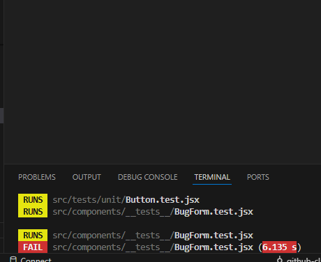

# MERN Bug Tracker Application  
**Week 6: Testing and Debugging in MERN Applications**

## 📘 Overview
This project is part of the **PLP Academy MERN Specialization Week 6 Assignment**, focused on **Testing and Debugging**.  
The goal is to ensure the reliability and stability of the MERN application using **Jest**, **Supertest**, and debugging tools.

---

## 🧩 Project Setup
- **Node.js** and **Express** for backend API  
- **MongoDB** for data storage  
- **Jest** and **Supertest** for unit and integration testing  
- **React Testing Library** for frontend component testing  

---

## ⚙️ Testing Strategy
1. **Unit Tests** – Validate isolated functionality such as controllers, routes, and utilities.  
2. **Integration Tests** – Test full API endpoints using Supertest to simulate HTTP requests.  
3. **Mocking** – Database and external dependencies are mocked to ensure isolated testing.  
4. **Frontend Tests** – Verify rendering, form validation, and user interactions using React Testing Library.  
5. **Continuous Testing** – Added test scripts in `package.json`:
   ```bash
   "scripts": {
       "test": "jest --runInBand"
   }
##  🧪 How to Run Tests

To execute all tests:

npm run test


This will output test results, including coverage data.

##  Screenshot


🧰 Debugging Tools and Techniques

Debugging was implemented using several methods to identify and fix application errors:

🔹 1. Console Logging

Strategically placed console.log() statements were used to monitor variable values and track data flow in both backend and frontend.

🔹 2. Chrome DevTools

Used for inspecting:

Network requests (API response status and payloads)

React component states and props

Console errors and warnings in real-time

🔹 3. Node.js Inspector

Launched the debugger with:

node --inspect server.js


Then accessed it through Chrome’s DevTools (chrome://inspect) to step through backend logic.

🔹 4. Error Boundaries in React

Implemented React error boundaries to catch component errors and display fallback UI instead of crashing the entire app.

🔹 5. Express Middleware Error Handling

Custom middleware in the backend handles errors and sends clear JSON error responses to the client.

✅ Expected Outcome

All unit and integration tests should pass.

Coverage should show over 80% for statements, branches, and functions.

Application should gracefully handle runtime errors both on server and client sides.

⚠️ Common Issues

If you encounter MongoDB connection errors during testing:

Ensure your tests are using a mocked database or a test database URI.

Make sure mongoose.connect runs before the tests begin.

👩‍💻 Author

Anagwu Precious Chinemerem
📍 Port Harcourt, Nigeria
📧 panagwu@gmail.com
